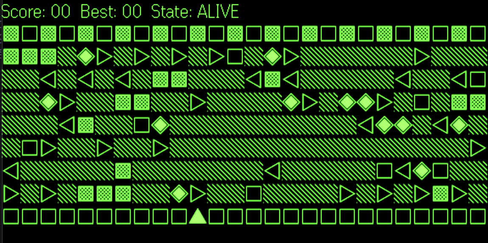
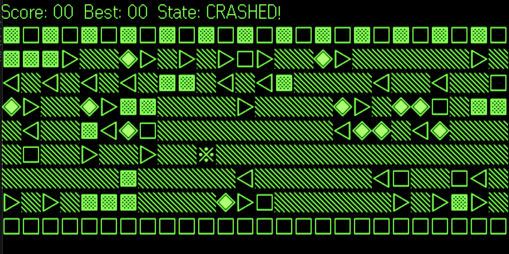

# EvenRoads

Text-first Crossy Roads / Frogger-style game for **Even Realities G2** smart glasses.

EvenRoads is designed around low-latency text container updates with deterministic gameplay and simulator-friendly preview behavior.

## Demo

<video src="assets/Demo_Video.mp4" controls width="640"></video>

## Screenshots

| Alive | Crashed |
|:-----:|:-------:|
|  |  |

## Quick links

- **In-app help:** Open the app URL on your phone to view game docs and controls from [index.html](index.html).
- **SDK + development references:** [docs/SDKandDevResources.md](docs/SDKandDevResources.md)
- **Performance baseline outputs:** [docs/perf/](docs/perf/)

## Tech stack

- **Runtime:** TypeScript, Vite
- **Game engine:** Internal deterministic engine in `src/game/`
- **Glasses bridge:** [Even Hub SDK](https://www.npmjs.com/package/@evenrealities/even_hub_sdk)
- **Rendering:** Text board rendering (device + simulator profiles)
- **Tests:** Node test runner (`node --test`) with TypeScript-to-CJS test compile step

## Project structure

```text
EvenRoads/
├── index.html                 # Entry page; docs/help UI + app mount roots
├── src/
│   ├── main.ts                # App bootstrap
│   ├── app/                   # Runtime orchestration + best-score persistence
│   ├── game/                  # Deterministic game state + tick/input transitions
│   ├── render/                # Text board rendering + simulator/device display profile
│   ├── evenhub/               # SDK bridge + startup page container composition
│   ├── input/                 # Even Hub event → gameplay action mapping
│   ├── perf/                  # Perf logging, timing, and debug instrumentation
│   └── debug/                 # On-page debug console
├── test/
│   ├── unit/                  # Unit tests
│   └── stress/                # Stress simulation tests
└── docs/
    ├── SDKandDevResources.md  # External SDK/CLI/resource links
    └── perf/                  # Baseline and latest perf summaries
```

## Prerequisites

- **Node.js** — v20 or newer
- **Even App + G2 glasses** — required for on-device testing
- **evenhub-cli** (optional) — helpful for QR launch workflows

## Setup

1. **Clone and install**
   ```bash
   git clone https://github.com/owner/EvenRoads.git
   cd EvenRoads
   npm install
   ```
2. **Run locally**
   ```bash
   npm run dev
   ```
3. **Open in Even App**
   - Run `npx evenhub qr` and scan in the Even App, or open your dev URL directly in the Even App browser.
4. **Try it**
   - On phone: use the URL to read docs/help.
   - On glasses: play with scroll/tap gestures.

## Usage on the glasses

- **Scroll up** → move left
- **Scroll down** → move right
- **Tap** → move up
- **Tap while crashed** → restart

## Scripts

| Command | Description |
|---------|-------------|
| `npm run dev` | Start dev server |
| `npm run build` | Type-check and build production bundle |
| `npm run preview` | Preview production build |
| `npm run typecheck` | Run TypeScript type-check only |
| `npm test` | Run compile + all unit/stress tests |
| `npm run test:unit` | Compile tests and run Node test suites |
| `npm run perf:analyze -- <logPath> --json <outPath>` | Analyze perf log output |
| `npm run perf:baseline` | Regenerate committed perf baseline summary |
| `npm run perf:compare -- <baseline> <candidate>` | Compare perf summaries |

## Build and deploy

```bash
npm run build
```

Output is in `dist/`. Deploy `dist/` to any static host, then open that URL in the Even App for production use.

## Features (summary)

- Deterministic Crossy Roads/Frogger-style gameplay with increasing difficulty
- Text-only board rendering tuned for Even Hub transport constraints
- One-time startup page creation + coalesced text updates
- Input dedupe guards for repeated event bursts from SDK/firmware paths
- Best score persistence via storage
- Simulator display profile support (including simulator-only right-edge trim for screenshot parity)

## Performance and responsiveness

EvenRoads includes explicit transport-pressure handling and render scheduling strategies:

- queued/coalesced text updates with priority-aware dropping
- tick-frame suppression under recent input or transport backpressure
- render and bridge timing instrumentation in `src/perf/log.ts`
- baseline/latest comparison workflow in `docs/perf/`

## License & credits

- **Even Hub SDK** — [@evenrealities/even_hub_sdk](https://www.npmjs.com/package/@evenrealities/even_hub_sdk)
- **Even Hub CLI** — [@evenrealities/evenhub-cli](https://www.npmjs.com/package/@evenrealities/evenhub-cli)
- **License** — MIT License. See [LICENSE](LICENSE).
